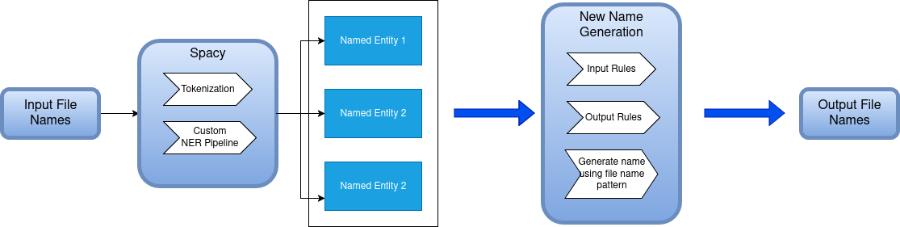
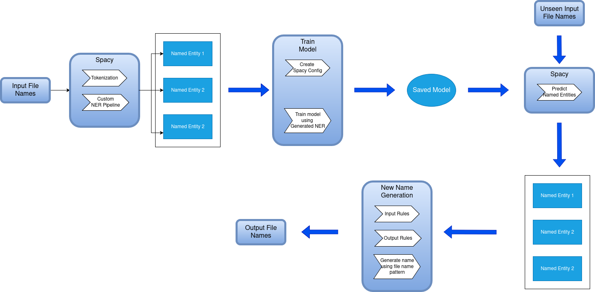
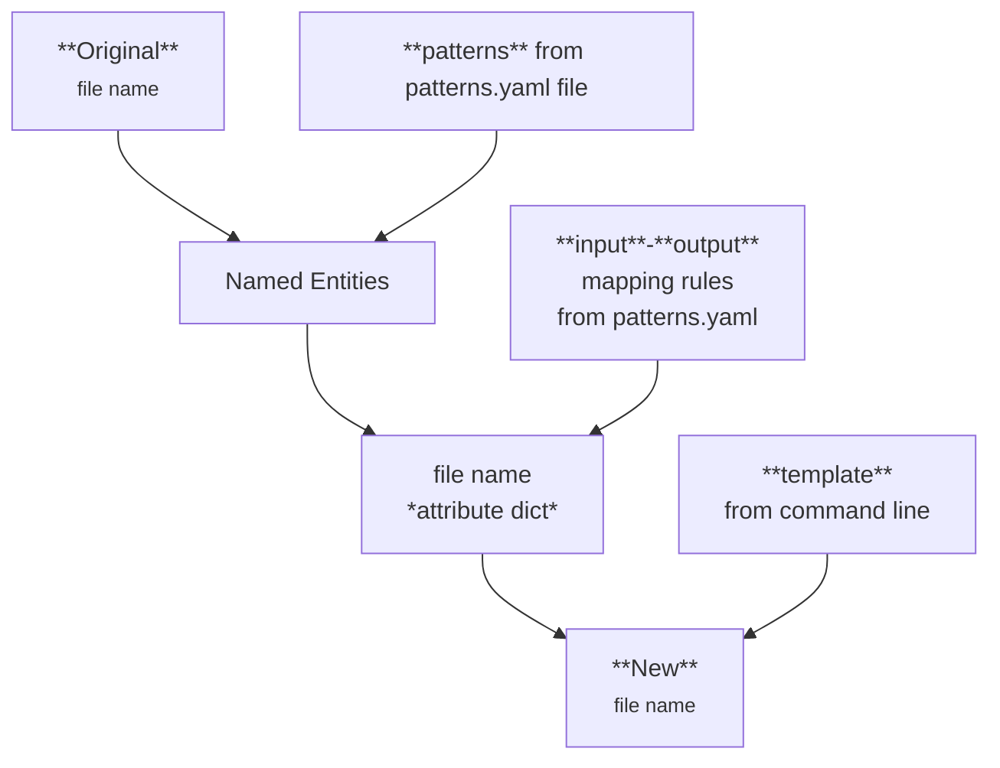
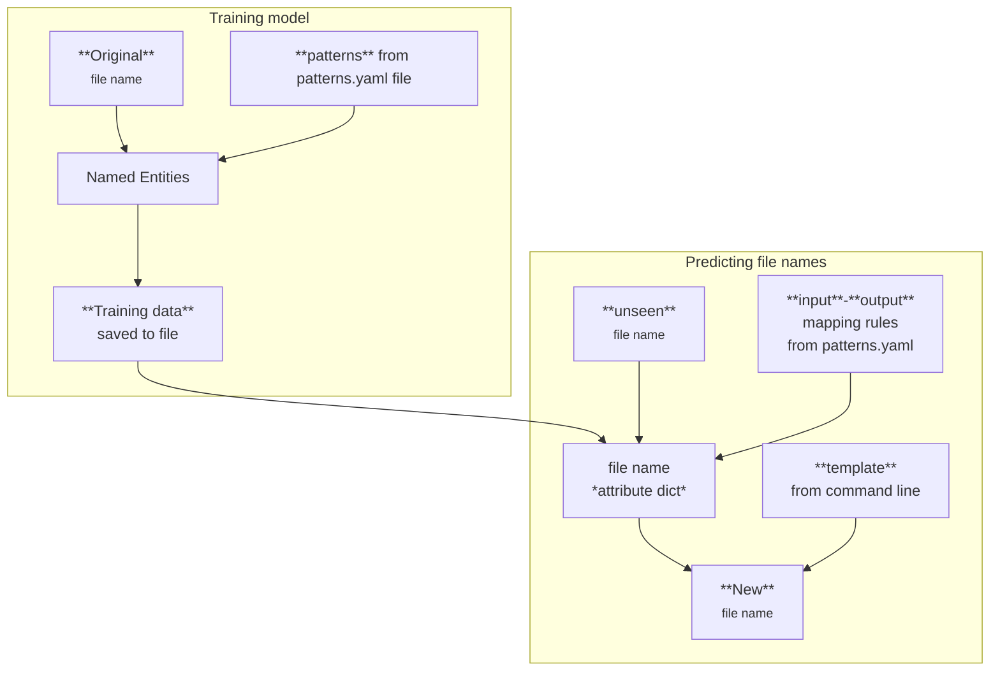

[![Contributors][contributors-shield]][contributors-url]
[![Forks][forks-shield]][forks-url]
[![Stargazers][stars-shield]][stars-url]
[![Issues][issues-shield]][issues-url]
[![MIT License][license-shield]][license-url]
[![LinkedIn][linkedin-shield]][linkedin-url]

# multi-file-renamer

**multi-file-renamer** is used to rename multiple files using [spacy rule based matching](https://spacy.io/usage/rule-based-matching) or using [trained models](https://spacy.io/usage/training).

To give you a taste, with single command line, following can be achieved:

| Original Name | New Name |
| :-- | :-- |
| 8139 Modern Review Volno-39(1926)-inernetdli2015467807.pdf | The_Modern_Review_,Volume_039,(1926).pdf |
| dli.bengal.10689.11376-THE MODERN REVIEW VOL.122(JULY-DECEMBER)1967-dlibengal1068911376.pdf | The_Modern_Review_,Volume_122,(1967),(July-December).pdf |
| in.ernet.dli.2015.114056-The Modern Review Vol Lxxi-inernetdli2015114056.pdf | The_Modern_Review_,Volume_071.pdf |
| Modern Review  1947-03: Vol 1 Iss 1 -modernreviewalcia_194703_1_1.pdf | The_Modern_Review_,Volume_001,No_1,(1947),(March).pdf |
| Modern Review  Summer 1949: Vol 3 Iss 1 -modernreviewalcia_summer1949_3_1.pdf | The_Modern_Review_,Volume_003,No_1,(1949).pdf |
| THE MODERN REVIEW VOL.113(JANUARY-JUNE)1963-dlibengal1068916872.pdf | The_Modern_Review_,Volume_113,(1963),(January-June).pdf |

As can be seen above, **multi-file-renamer** is able to rename files with very different naming structure and conventions into a consistent naming pattern. Depending upon user input **multi-file-renamer** is able to extract relevant information from *original* file name and use it to construct a *new* file name.


## Rename files using rule based matching

For renaming files using rule based matching, user needs to supply spacy [match rules](https://spacy.io/usage/rule-based-matching) that can be used to extract relevant information, *input-output mapping rules* and *template pattern*.



## Rename files using trained model flow

For renaming files using trained model, first a trained model is created that will identify named entities. The model is created by generating named entities for a relatively small set of file names. Once model has been created it can be used to predict new file names using user supplied *input-output mapping rules* and *template pattern*.



# Installation
## Requirements

**multi-file-renamer** requires *python 3* and a bunch of other dependencies mentioned in `requirements.txt` file.

## Setup
Before running **multi-file-renamer** the python environment needs to be setup correctly. Here we are creating a python virtual environment and installing all the dependencies. The instructions are provided for *Linux*, but ideally these should be identical for any *UNIX* like operating system.

### Create virtual environment and install dependencies

The following Change to the folder/directory containing 

```bash
python -m venv venv
. venv/bin/activate
pip install -r requirements.txt
```
### Activating virtual environment

Creating virtual environment and installing dependencies is one time process. In subsequent runs you just need to activate the virtual environment:
```bash
. venv/bin/activate
```

To deactivate the virtual environment run the command: `deactivate`.

# Usage

The way **multi-file-renamer** works is as a first step one generates *new* file names. Next user verifies that names are correct (or even fix them by hand, if required) by checking the *file_names.json* file. And finally rename the files as the last step.

## Generate new file names

For generating files we have two options:

1. **Using rule based matching**: In this method *new* file names are extracted using predefined static rules specified in file `patterns.yaml`.
2. **Using trained model**: In this method a model is trained first. For generating training data *rule based matching* is used. Once this training data has generated, next step is to create a model which can be used any number of times to predict the *new* file names.

### Option 1: Using rule based matching

User needs to create a `patterns.yaml` file similar to one in [samples](samples/patterns.yaml) directory. This file contains *patterns* as per spacy [match rules](https://spacy.io/usage/rule-based-matching) syntax that can be used to extract *named entities*. Additionally it has *input-output mapping rules* that lead to generation of *file name attribute dict*. The *file name attribute dict* together with user supplied template is used to generate *new* files names.

This is the flow in the daigram form:



More information about it is available in Configuration section of this page.

#### Extract new file names from old file names

In this step we create a file (by default `file_names.json`) that contains mapping between *old* file names and *new* file names. User supplies a `patterns.yaml` file that is used to identify named entities and *input-output mapping rules* to help extract the relevant data from named entities. Additionaly user supplies a *template* which is used to generate *new* file names. The template can have [jinja](https://jinja.palletsprojects.com/en/stable/) code allowing for conditional formatting and placeholders values are substituted using *file name attribute dict*.

```bash
python multi-file-renamer.py \
  extract \
  -l samples/patterns.yaml \
  --excludes in.ernet.dli.2015. \
  -s file_names.json \
  -m volume \
  -t "The_Review_,Volume_{{'%03d'|format(volume|int)}},No_{{number}},({{year}}),({{month}}).pdf" \
  file1.pdf file2.pdf directory
```

In the above command,
- `-l` specifies the path of `patterns.yaml` file
- `--excludes` specifies sub strings that are part of original file names but should be ignored as they would interfere with rule matching. In the above example, a file name like `in.ernet.dli.2015.114056-The Modern Review Vol Lxxi-inernetdli2015114056.pdf` would lead to *2015* being identified as year (which is actually just file scan year). So this way, we prevent processing of part of file names.
- `-s` specifies the file where *original* to *new* file name mapping should be stored.
- `-m` specifies attribute names which are considered mandatory. That is if they are not found *new* file name is not generated at all.
- `-t` specifies file name template to be used to generate file name. It supports [jinja](https://jinja.palletsprojects.com/en/stable/) templating syntax.
- last argument is list of files or directories to be renamed. Note if you provide directories they will be processed recursively.

Once the above command is executed it will generate a file `file_names.json`.

To help you understand here is *original* file name => *file name attribute dict* => *new* file name table for an example run with [patterns.yaml](samples/patterns.yaml):

| Original Name | File name attribute dict | New Name |
| :-- | :-- | :-- |
| 8139 Modern Review Volno-39(1926)-inernetdli2015467807.pdf | `{ "volume": "39", "year": "1926" }` | The_Modern_Review_,Volume_039,(1926).pdf |
| dli.bengal.10689.11376-THE MODERN REVIEW VOL.122(JULY-DECEMBER)1967-dlibengal1068911376.pdf | `{ "volume": "122", "year": "1967", "month": "July-December" }` | The_Modern_Review_,Volume_122,(1967),(July-December).pdf |
| in.ernet.dli.2015.114056-The Modern Review Vol Lxxi-inernetdli2015114056.pdf | `{ "volume": "71" }` | The_Modern_Review_,Volume_071.pdf |
| Modern Review  1947-03: Vol 1 Iss 1 -modernreviewalcia_194703_1_1.pdf | `{ "volume": "1", "year": "1947", "month": "March", "number": "1" }` | The_Modern_Review_,Volume_001,No_1,(1947),(March).pdf |
| Modern Review  Summer 1949: Vol 3 Iss 1 -modernreviewalcia_summer1949_3_1.pdf | `{ "volume": "3", "year": "1949", "number": "1" }` | The_Modern_Review_,Volume_003,No_1,(1949).pdf |
| THE MODERN REVIEW VOL.113(JANUARY-JUNE)1963-dlibengal1068916872.pdf | `{ "volume": "113", "year": "1963", "month": "January-June" }` | The_Modern_Review_,Volume_113,(1963),(January-June).pdf |

### Option 2: Using trained model

The following diagram explains the entire process:



#### Generate Training data

```bash
python multi-file-renamer.py \
  generate \
  -l patterns.yaml \
  --excludes in.ernet.dli.2015. \
  --training-save-path train_data.spacy \
  --testing-save-path train_data_dev.spacy \
  file1.pdf file2.pdf directory
```

In the above command,
- `--training-save-path` specifies the path where train data is saved
- `--testing-save-path` specifies the path where test data is saved

#### Generating Model

Run the following command to generate model in the `./output` directory:

```bash
python -m spacy init config ./config.cfg --lang en --pipeline ner
python -m spacy train ./config.cfg --output ./output --paths.train ./train_data.spacy --paths.dev ./train_data_dev.spacy
```

#### Predict New File Names

```bash
python multi-file-renamer.py \
  predict \
  --model output/model-best \
  -l patterns.yaml \
  --excludes in.ernet.dli.2015. \
  -m volume \
  -p "The_Modern_Review_,Volume_{{'%03d'|format(volume|int)}},No_{{number}},({{year}}),({{month}}).pdf"\
  file1.pdf file2.pdf directory
```

`--model` specifies the location of the model. Other options are explained elsewhere.

## Rename original file name to new file name

```bash
python multi-flile-renamer.py \
  rename from \
  -l file_names.json \
  -s restore_data.json
```

In the above command,
- `-l` specifies the path of file containing *old* to *new* file name mapping.
- `-s` specifies the path of file that will contain restoration data.

Note, renaming of files takes into account existence of another file with the same name, and will append suffix like `-1` to make it unique.

# Configuration

## Patterns file

Patterns file is a [YAML](https://yaml.org/) file. It has the following structure:

```yaml
{{match_entity_label}}:
    input: {{input_rules}}
    output: {{output_rules}}
    patterns: {{spacy_match_patterns}} 
```

In the above, `match_entity_label` is the label to assigned to recognized entity using pattern `spacy_match_patterns` during the NER (Named Entity Recognition) phase. `spacy_match_patterns` is a list of patterns as specified by the [spacy rule based matching](https://spacy.io/usage/rule-based-matching). A sample file is available [here](docs/samples/patterns.yaml).

`input_rules` and `output_rules` specify as to what should be the output produced from a given Named Entity.

## Input Rules

| Input Type | Fields | Value and type | Description |
| :-- | :-- | :-- | :-- |
| **single** | **index**  | - an int or<br>- keyword *start* or<br>- keyword *end* | Returns text from specific *index* of the matched Span.<br>Equivalent to `span.doc[index].text`, where<br>- keyword *start* is same as `span.start`<br>- keyword *end* is same as `span.end` |
| **all** | N/A  | N/A  | Returns all text from matched Span<br>Equivalent to `span.text` |
| **distinct** | **indexes** | list where each item is either:<br>- an int or<br>- keyword *start* or<br>- keyword *end* | Returns a list of items, each of which is text from specific *index* of the matched Span.<br>Equivalent to `[span.doc[i].text for i in indexes]`, where<br>- keyword *start* is same as `span.start`<br>- keyword *end* is same as `span.end`<br>- a positive number means an offset from `span.start`<br>- a negative number means an offset from `span.end` |
| **multi** | **start**<br>**end** | Both can be either:<br>- an int or<br>- keyword *start* or<br>- keyword *end* | Returns a list of items, each of which is text from all the indexes between **start** (inclusive) and **end** (exclusive) of the matched Span.<br>Equivalent to `[span.doc[i].text for i in range(start, end)]`, where<br>- keyword *start* is same as `span.start`<br>- keyword *end* is same as `span.end` |

### Example 1
For the following output rule:

```yaml
type: single
index: end
```

the table below summarizes the behaviour:

| Input | Output |
| :-- | :-- |
| `[ "volume", "46" ]` | `"46"` |
| `[ "vol", "xvii" ]` | `"xvii"` |

### Example 2
For the following output rule:

```yaml
type: all
```

the table below summarizes the behaviour:

| Input | Output |
| :-- | :-- |
| `[ "volume", "46" ]` | `"volume 46"` |
| `[ "vol", "xvii" ]` | `"vol xvii"` |

### Example 3

For the following output rule:

```yaml
type: distinct
indexes:
    - start
    - end
```

the table below summarizes the behaviour:

| Input | Output |
| :-- | :-- |
| `[ "apr", "to", "nov" ]` | `[ "apr", "nov" ]` |
| `[ "may", "jun" ]` | `[ "may", "jun" ]` |


### Example 4

For the following output rule:

```yaml
type: multi
start: 1
end: end
```

the table below summarizes the behaviour:

| Input | Output |
| :-- | :-- |
| `[ "a", "b", "c", "d" ]` | `[ "b", "c", "d" ]` |
| `[ "a", "b" ]` | `[ "b" ]` |

## Output Rules

| Output Type | Fields | Mandatory | Description |
| :-- | :-- | :-- | :-- |
| **type** | enum | always | Any one of the values<br>- single<br>- multi<br>**single** means result is a *dict* single key: value pair<br>**multi** means result is a *dict* of multiple key: value pairs |
| **index** | str | only if **type** is **single** | This is the key of result dictionary. In other words, this can be referred in file name pattern. |
| **outputs** | list of output rules | only if **type** is **multi** | Each item is a output rule which is applied against the input. If input is a python *list* or *tuple*, each corresponding output rule is applied against input item. If input is single text, each rule is applied against input. |
| **handler** | enum | no | This defines the special handler function (already implemented in python code to produce output as per the supplied **args**.<br>Currently supported handlers are:<br>- **convert_roman_nums**<br>- **date**<br>- **joiner** |
| **args** | dict | only in case a **handler** is defined and it requires arguments | |

**Example when type is single**

For the following output rule:
```yaml
type: single
index: year
```

the table below summarizes the behaviour:

| Input | Output |
| :-- | :-- |
| 2014 | `{ "year": "2014" }` |
| 1990 | `{ "year": "1990" }` |

**Example when type is multi**

For the following output rule:
```yaml
    type: multi
    outputs:
      - type: single
        index: year
        handler: date
        args:
          format: "%Y"
      - type: single
        index: month
        handler: date
        args:
          format: "%B"
```

the table below summarizes the behaviour:

| Input | Output |
| :-- | :-- |
| 2014-04 | `{ "year": "2014", "month": "April" }` |
| 1990-2 | `{ "year": "1990", "month": "February" }` |

### Handlers

Handlers are specialized function that convert given input into a desired output. The handlers receive input text as input and can optionally have additional arguments.

#### convert_roman_nums Handler

This handler convert input roman numerals, for example *xvi* to its corresponding Indian/Hindu numeric value, viz. *16*. If input is not a roman numeral, it is left unchanged.

**Example**

For the following output rule:
```yaml
type: single
index: volume
handler: convert_roman_nums
```
the table below summarizes the behaviour:
| Input | Output |
| :-- | :-- |
| 14 | `{ "volume": "14" }` |
| cxiv | `{ "volume": "116" }` |

#### date Handler

This handler converts input into format supported by [strftime](https://docs.python.org/3.14/library/datetime.html#datetime.datetime.strftime). This handler takes following arguments:

| Argument | Type | Mandatory | Description |
| :-- | :-- | :-- | :-- |
| **format** | str | yes | This parameter specifies the date formatting to use. More specifically, it is same as format parameter of python's [strftime](https://docs.python.org/3.14/library/datetime.html#datetime.datetime.strftime) |

**Example**

For the following output rule:
```yaml
type: single
index: month
handler: date
args:
    format: "%B"
```
the table below summarizes the behaviour:
| Input | Output |
| :-- | :-- |
| Dec | `{ "month": "December" }` |
| december | `{ "month": "December" }` |

#### joiner Handler

This handler converts an input which is either python *list* or *tuple* into a single string joining them using supplied separator. This handler takes followin arguments:

| Argument | Type | Mandatory | Description |
| :-- | :-- | :-- | :-- |
| **separator** | str | yes | This is the seprator |
| **outputs** | list of output rules | no | This is list of output rules applied to each item in the input list before joining them together. See example below. |
| **exclusions** | list of str | no | This is a list of exclusion values. These values will not be considered for output. |

Remember **join** requires input to be either python's *tuple* or *list*.

**Example**

For the following output rule:
```yaml
type: single
index: number
handler: joiner
args:
    separator: "-"
    exclusions: [":", "to"]
```
the table below summarizes the behaviour:
| Input | Output |
| :-- | :-- |
| `[ "1", "to", "6" ]` | `{ "number": "1-6" }` |
| `[ "2", "5" ]` | `{ "number": "2-5" }` |


**Another Example**

For the following output rule:
```yaml
type: single
index: month
handler: joiner
args:
    separator: "-"
    outputs:
    - type: single
      handler: date
      args:
        format: "%B"
    - type: single
      handler: date
      args:
        format: "%B"
```
the table below summarizes the behaviour:
| Input | Output |
| :-- | :-- |
| `[ "jan", "apr" ]` | `{ "month": "January-April" }` |
| `[ "july", "october" ]` | `{ "month": "July-October" }` |

Note in this case **joiner** handler is calling **date** handler internally.

<!-- MARKDOWN LINKS & IMAGES -->
<!-- https://www.markdownguide.org/basic-syntax/#reference-style-links -->
[contributors-shield]: https://img.shields.io/github/contributors/homebackend/multi-file-renamer.svg?style=for-the-badge
[contributors-url]: https://github.com/homebackend/multi-file-renamer/graphs/contributors
[forks-shield]: https://img.shields.io/github/forks/homebackend/multi-file-renamer.svg?style=for-the-badge
[forks-url]: https://github.com/homebackend/multi-file-renamer/network/members
[stars-shield]: https://img.shields.io/github/stars/homebackend/multi-file-renamer.svg?style=for-the-badge
[stars-url]: https://github.com/homebackend/multi-file-renamer/stargazers
[issues-shield]: https://img.shields.io/github/issues/homebackend/multi-file-renamer.svg?style=for-the-badge
[issues-url]: https://github.com/homebackend/multi-file-renamer/issues
[license-shield]: https://img.shields.io/github/license/homebackend/multi-file-renamer.svg?style=for-the-badge
[license-url]: https://github.com/homebackend/multi-file-renamer/blob/master/LICENSE
[linkedin-shield]: https://img.shields.io/badge/-LinkedIn-black.svg?style=for-the-badge&logo=linkedin&colorB=555
[linkedin-url]: https://linkedin.com/in/neeraj-jakhar-39686212b

